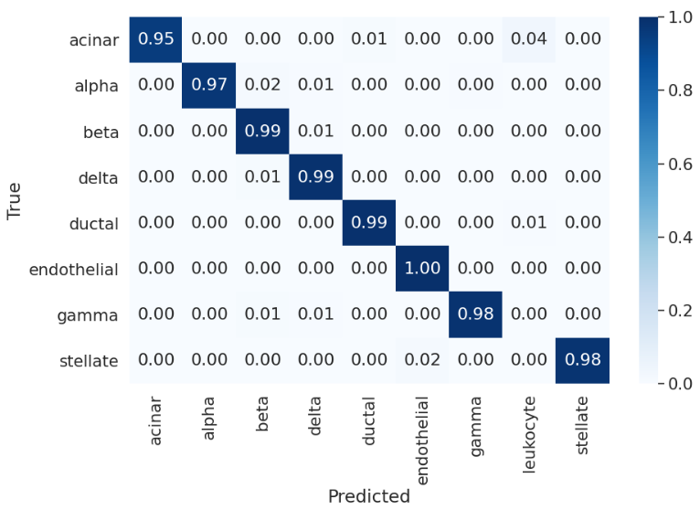

# scAdapt: Virtual adversarial domain adaptation network for single cell RNA-seq data classification across platforms and species
This repository contains the preprocessed data and Python implementation for scAdapt. scAdapt is a virtual adversarial domain adaptation network to transfer single cell labels between datasets with batch effects. scAdapt used both the labeled source and unlabeled target data to train an enhanced classifier, and aligned the labeled source centroid and pseudo-labeled target centroid to generate a joint embedding.

<p align="center">
    
</p>

# Requirements

pyTorch>=1.1.0
umap-learn>=0.3.8
universal-divergence>=0.2.0

# Data preparation

Log-normalized count matrix is recommonded as the input of scAdapt. Raw counts matrix can be normalized by the NormalizeData function in Seurat with default ‘LogNormalize’ normalization method and a scale factor of 10,000. We use top 2000 highly variable genes as input features. We provided an example of processed datasets in the `scAdapt/processed_data` folder as follows:
`combine_expression.csv` is the expression matrix [gene, cell] combining source and target.
`combine_labels.csv` is the cell type label array combining source and target.
`domain_labels.csv` is the batch/domain label array combining source and target.
`digit_label_dict.csv` is the one-to-one mapping between digital label and cell type label.

# Usage

### API usage

Here is example API usage of scAdapt in Python:

```
from scAdapt import scAdapt
from config import * # set hyper-parameters

dataset_path = args.dataset_path 
normcounts = pd.read_csv(dataset_path + 'combine_expression.csv')
labels = pd.read_csv(dataset_path + 'combine_labels.csv')
domain_labels = pd.read_csv(dataset_path + 'domain_labels.csv')
data_set = {'features': normcounts.T.values, 'labels': labels.iloc[:, 0].values,
'accessions': domain_labels.iloc[:, 0].values}

scAdapt(args=args, data_set=data_set)
```

### Python script usage

An example of how to use scAdapt for both classification and batch correction is:

```bash
python main.py --dataset_path path/to/input/files
               --result_path path/for/output/files
               --source_name batch name
               --target_name batch name
	       --gpu_id GPU id to run
```

The `dataset_path` must contain the four CSV files preprocessed as in `scAdapt/processed_data` folder. In `result_path`, there will be three output files: `final_model_*.ckpt` has the trained model    parameters (i.e. weights and biases) and can be loaded for label prediction. `pred_labels_*.csv` contains the predicted cell label and corresponding confidence score (softmax probability). `embeddings_*.csv` contains the batch-corrected low-dimensional embeddings (default is 256) for visualization.

### Demo

A demo file `example.py` is provided in the `scAdapt` folder, and the corresponding datasets are provided in the `scAdapt/processed_data` folder. In the demo, we use mouse pancreas data (Baron and Tabula Muris) as source and human pancreas data (Segerstolpe) as target. The demo can be run with the following command with default parameters:

`python example.py`

We can evaluate how well our predicted cell type labels match the true labels with Confusion heatmap. For this demo dataset, we find that there is a perfect agreement (Average acc = 0.98) in cell type prediction.

<p align="center">
    
</p>

We can also plot the low-dimensional embeddings of scAdapt model by UMAP. We can find that the cells from mouse and human dataset are well mixed by cell type while the clusters of different cell types are separated clearly.

<p align="center">
    
</p>

# Questions

For questions about the datasets and code, please contact [zhoux85@mail2.sysu.edu.cn](mailto:zhoux85@mail2.sysu.edu.cn).

